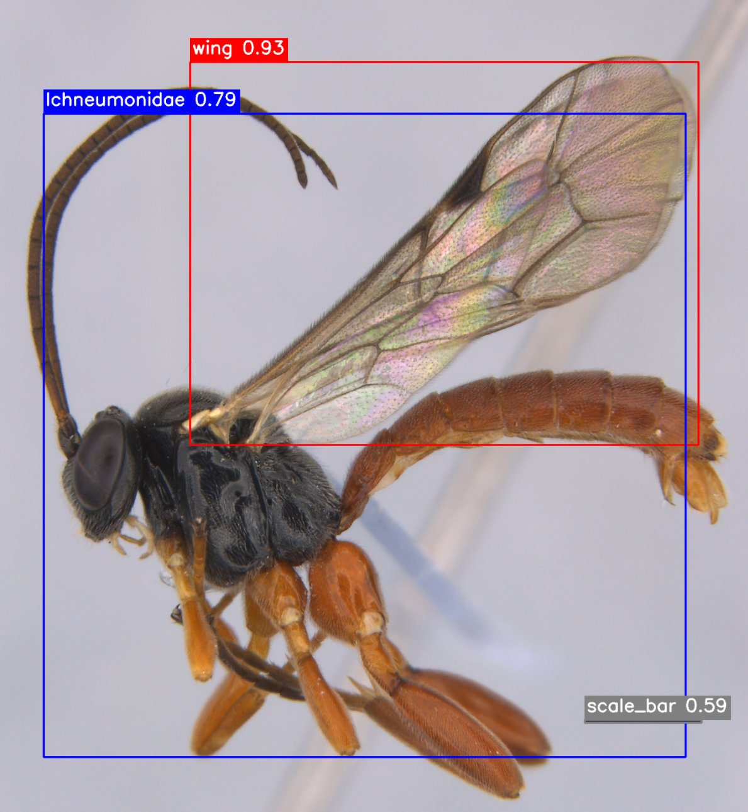
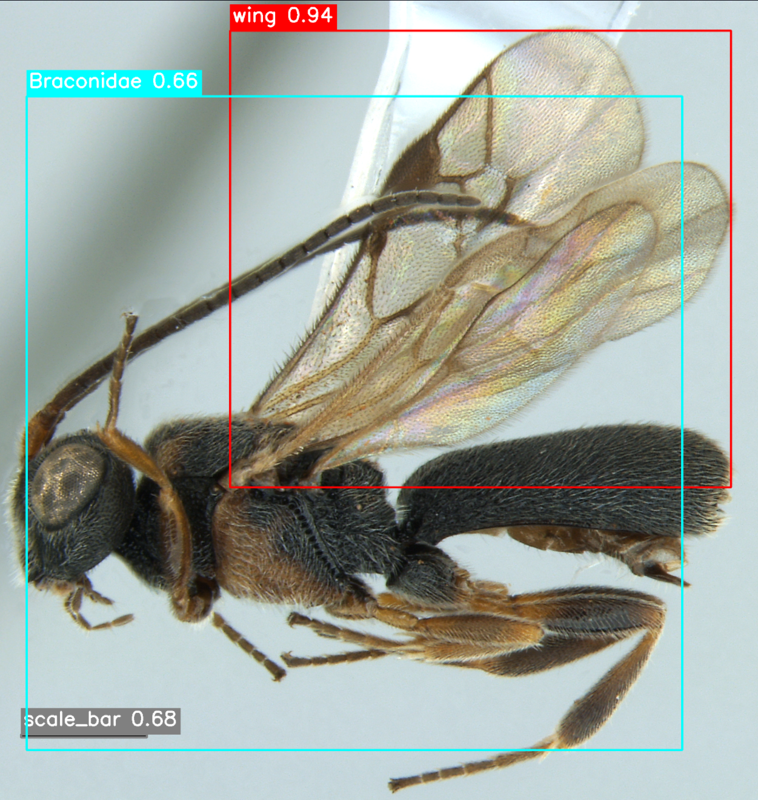

# 🐝 Dataset of Parasitoids Waps and Associated Hymenoptera (DAPWH)
This repository contains the data processing pipelines and training workflows developed for the DAPWH dataset. It includes scripts for preprocessing, dataset split, model training, and evaluation of classification and detection models.

*An Ichneumonidae wasp detected.*


*A Braconidae wasp detected.*
## Dataset Availability
Comprising the families Ichneumonidae and Braconidae, these parasitoid wasps are ecologically critical for the regulation of insect populations, yet they remain one of the most taxonomically challenging groups due to their cryptic morphology and vast number of undescribed species. To address the scarcity of robust digital resources for these key groups, we present a curated image dataset designed to advance automated identification systems. The dataset contains 3,556 high-resolution images, primarily focused on Neotropical Ichneumonidae and Braconidae, while also including supplementary families such as Andrenidae, Apidae, Bethylidae, Chrysididae, Colletidae, Halictidae, Megachilidae, Pompilidae, and Vespidae to improve model robustness. Crucially, a subset of 1,739 images is annotated in COCO format, featuring multi-class bounding boxes for the full insect body, wing venation, and scale bars. This resource provides a foundation for developing computer vision models capable of identify this families.

The DAPWH dataset is publicly available on Zenodo:

[https://zenodo.org/records/18501018](https://zenodo.org/records/18501018)
DOI: [https://doi.org/10.5281/zenodo.18501017](https://doi.org/10.5281/zenodo.18501017)

The paper citation can be found in:

[Dataset of Parasitoids Wasps and Associated Hymenoptera (DAPWH)](https://zenodo.org/records/18501018)

## Scripts

This repository includes the following Python scripts to support dataset preparation and model training workflows:

* **`cls_split_data.py`**
  Splits the classification dataset into training, validation, and test subsets.

* **`cls_train_models.py`**
  Trains state-of-the-art image classification models.

* **`scripts/split_data.py`**
  Splits the COCO-format detection subset into training, validation, and test sets.

* **`scripts/coco2yolo.py`**
  Converts COCO-style annotations into YOLO-format annotations (bounding boxes or segmentation masks).

## Classification

This section describes how to replicate the classification benchmarks for the **DAWPDset**. We evaluated several state-of-the-art architectures, including **EfficientNetV2-S**, **YOLOv12s-cls**, **ConvNeXt-Tiny**, **ResNet-50**, and **VGG16**.

### Prerequisites

1. **Download the Dataset**: Ensure you have downloaded the **DAPWH** folder.
2. **Environment**: A Python environment with `torch`, `torchvision`, and `ultralytics` installed is recommended. If required, download the pretrained weight file (`yolov12s-cls.pt`) from the official YOLO website before training.
3. **Hardware**: Benchmarks were performed on a workstation equipped with an **NVIDIA RTX 4090**.

### 1. Data Preparation (`cls_split_data.py`)

Before training, you must split the raw images (organized by **Dorsal_Ventral**, **Frontal**, and **Lateral** views) into training, validation, and test sets.

* **Action**: Open `cls_split_data.py` and update the `dataset_folder` variable to point to your local path, exemple: `/Documents/DAPWH`.
* **Function**: This script ensures that each family (e.g., **Ichneumonidae**, **Braconidae**) is balanced across the splits to maintain taxonomic integrity.

###  Model Training (`cls_train_models.py`)

This script handles the training for all architectures

* **Usage**: Update the `MODEL_LIST` within the script to select which architectures to train:
```python
MODEL_LIST = [
    ('efficientnet_v2_s', 'torch', 'DEFAULT'),
    ('convnext_tiny',     'torch', 'DEFAULT'),
    ('vit_b_16',          'torch', 'DEFAULT'),
    ('vgg16',             'torch', 'DEFAULT'),
    ('resnet50',          'torch', 'DEFAULT'),
    ('yolov12s-cls.pt',    'yolo',  None)
]
```

### Directory Structure Requirement

To ensure the scripts run correctly, maintain the following structure:

```text
DAPWH/
├── Dorsal_Ventral/
│   ├── Ichneumonidae/
│   └── Braconidae/
├── Frontal/
│   └── ...
└── Lateral/
    └── ...
```

## Detection

This section outlines the workflow for object detection within the **DAWPDset**. This process involves preparing the COCO-formatted annotations for YOLO training and benchmarking the **YOLOv8** and **YOLOv12** architectures.

### 1. Dataset Splitting

To ensure a robust evaluation, the dataset is divided into training, validation, and test sets using the `split_data.py` script.

* **Configuration**: Set the following paths in your environment, for example:
* `IMAGES_DIR = 'Documents/DAPWH/COCO_subset/images/default'`
* `JSON_FILE = 'Documents/DAPWH/COCO_subset/annotations/instances_default.json'`
* `OUTPUT_DIR = 'Documents/DAPWH_split'`

* **Execution**: Run the splitting script with a 70/15/15 ratio:
```bash
!python scripts/split_data.py $IMAGES_DIR $JSON_FILE $OUTPUT_DIR --train_ratio 0.7 --val_ratio 0.15

```

### 2. Format Conversion (COCO to YOLO)

Since the **DAPWH** dataset uses COCO annotations by default, they must be converted to the YOLO `.txt` format for detection training.

* **Execution**: Use the `coco2yolo.py` script in detection mode:
```bash
path_detection_dataset = 'Documents/DAPWH_split'
!python scripts/coco2yolo.py $path_detection_dataset --mode detection
```

### 3. Model Training
We benchmarked two generations of YOLO models YOLOv8 and YOLOv12

#### YOLOv8
```python
from ultralytics import YOLO

model = YOLO("yolov8m.pt")

results = model.train(
    data=path_detection_train,
    epochs=150,
    imgsz=1280,
    batch=4,
    device=0,
    workers=8,
    name="yolov8_detection",
)
```
#### YOLOv12
```python

from ultralytics import YOLO
model = YOLO("yolov12s.pt")

results = model.train(
    data=path_detection_train,
    epochs=150,
    imgsz=1280,       
    batch=4,         
    device=0,
    workers=8,
    name="yolov12_detection",
)
```
